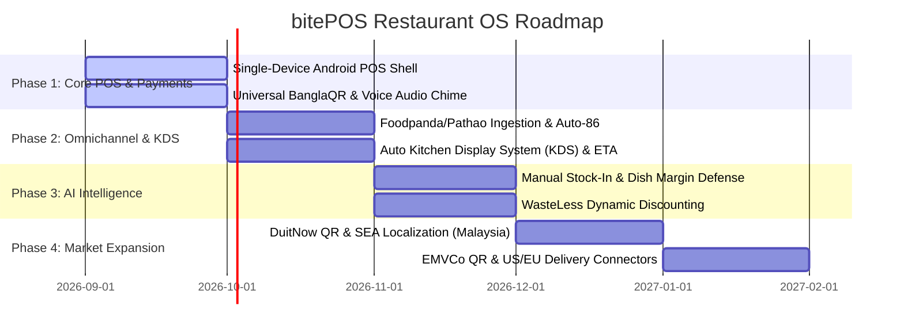

# 🍳 bitePOS Restaurant OS: Project Overview

---

## 1. Executive Summary

**bitePOS Restaurant OS** is an ambient AI-powered Operating System designed for **small and medium-sized restaurants, cloud kitchens, fast-food stalls, bakeries, sweet shops, and tea bars**. Built specifically for emerging markets (Bangladesh, Malaysia, SEA) with expansion paths to Europe and the US, it replaces $1,500+ worth of fragmented hardware—multiple food delivery tablets, laminated payment QR codes, paper kitchen spikes, and legacy billing registers—with a **single, affordable Android POS terminal ($100–$150)**.

The core innovation is **"Agents Leaving the Chatbox"**: instead of an isolated conversational tab, an operational AI agent lives ambiently across the counter billing touchscreen, Auto Kitchen Display System (KDS), thermal receipt printer, POS speaker, and payment processing pipeline.

---

## 2. Problem Statement

### A. The "Tablet Hell" & Hardware Clutter
Food vendors currently maintain 3 to 5 separate devices on their counter:
* Tablet #1 for **Foodpanda**
* Tablet #2 for **Pathao Food / GrabFood**
* Tablet #3 for **Foodi / UberEats**
* Personal smartphone for checking **bKash / Nagad / MFS** SMS payment alerts
* Paper ledger or standalone register for **In-Store billing**

### B. High Food Waste & Perishable Spoilage
Unsold prepped items (daily specials, baked goods, sweets/mishti, dairy bases) frequently spoil before end-of-day because vendors lack real-time dynamic discounting tools.

### C. Ingredient Price Volatility & Invisible Margin Loss
Wholesale market prices for fresh produce, poultry, and oil fluctuate daily without any central online API. Food vendors routinely lose profit margins without realizing their dish production costs have surpassed their static menu prices.

---

## 3. Target Customer Personas

```
┌───────────────────────────┬───────────────────────────┬───────────────────────────┐
│ Persona A: Food Stall /   │ Persona B: Medium         │ Persona C: Cloud Kitchen  │
│ Kiosk Owner               │ Restaurant Manager        │ & Bakery Operator         │
├───────────────────────────┼───────────────────────────┼───────────────────────────┤
│ • Single-person operation │ • 10-20 tables, 5+ staff  │ • 100% delivery-based     │
│ • Tight counter space     │ • Kitchen rush chaos      │ • High platform fees      │
│ • Needs fast cash/QR pay  │ • Slow delivery handovers │ • Strict stock-out alerts │
│ • Target: Bangladesh/MY   │ • Target: Urban centers   │ • Target: Multi-market    │
└───────────────────────────┴───────────────────────────┴───────────────────────────┘
```

---

## 4. Key Value Proposition & ROI

1. **Hardware Capital Expenditure (CapEx) Reduction:** Cuts setup costs from $1,500+ down to $100–$150 by running billing, delivery aggregation, and kitchen display on a single handheld POS terminal.
2. **Zero Order Cancellations:** Automatic "Auto-86" stock synchronization pauses dishes across Foodpanda, Pathao, and Foodi the instant they sell out in-store, eliminating platform penalties.
3. **20–30% Reduction in Food Waste:** Ambient WasteLess AI identifies near-expiry stock and suggests one-tap POS discounts during afternoon off-peak hours.
4. **Instant Margin Protection:** 5-second manual stock-in logs recalculate dish margins in real-time, alerting managers to adjust prices when ingredient costs spike.

---

## 5. Product Roadmap


